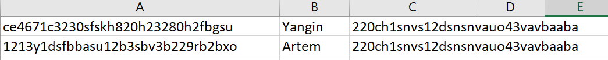
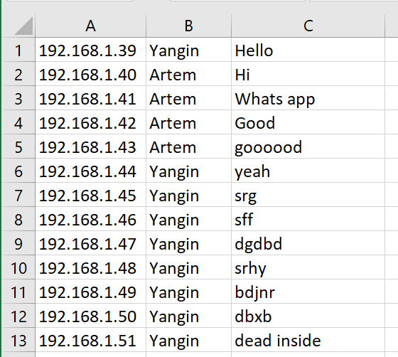
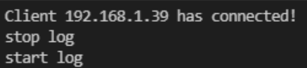

Пунтк 2 представлен в файлах server.py и client.py
2. Модифицировать простой эхо-сервер таким образом, чтобы при подключении клиента создавался новый поток, в котором происходило взаимодействие с ним.
Новые потоки для каждого клиента создаются тут

Результат подключения клиентов представлен здесь

3. Реализовать простой чат сервер на базе сервера аутентификации. Сервер должен обеспечивать подключение многих пользователей одновременно, отслеживание имен пользователей, поддерживать историю сообщений и пересылку сообщений от каждого пользователя всем остальным.
Чат реализован на TCP сокетах
О клиентах следующие данные: информация об IP клиента хранится в зашифрованном виде, логин, пароль тоже в зашифрованном виде
Они хранятся построчно в csv файле
история сообщений хранится в файле .csv
Регистрация клиента

Файл регистрации теперь выглядит так clients.csv и записывается в разные ячейки полученные данные

Смотрим что выводит в это время сервер

Посмотрим как выглядит переписка у пользователей и сервера

История сообщений

4. Реализовать сервер с управляющим потоком. При создании сервера прослушивание портов происходит в отдельном потоке, а главный поток программы в это время способен принимать команды от пользователя. Необходимо реализовать следующие команды:
Отключение сервера (завершение программы) командой shutdown

Пауза (остановка прослушивание порта) командами ключения и отключения stop listen start listen

У клиента ничего не происходит, он ожидает соединения, так как мы запретили подключения
Если мы введем start listen то клиент сразу подключится

Показ логов выключается и включается командами stop log start log

Очистка логов очищается сам файл логов и консоль командой clear log

Очистка файла идентификации выполняется командой clear file

